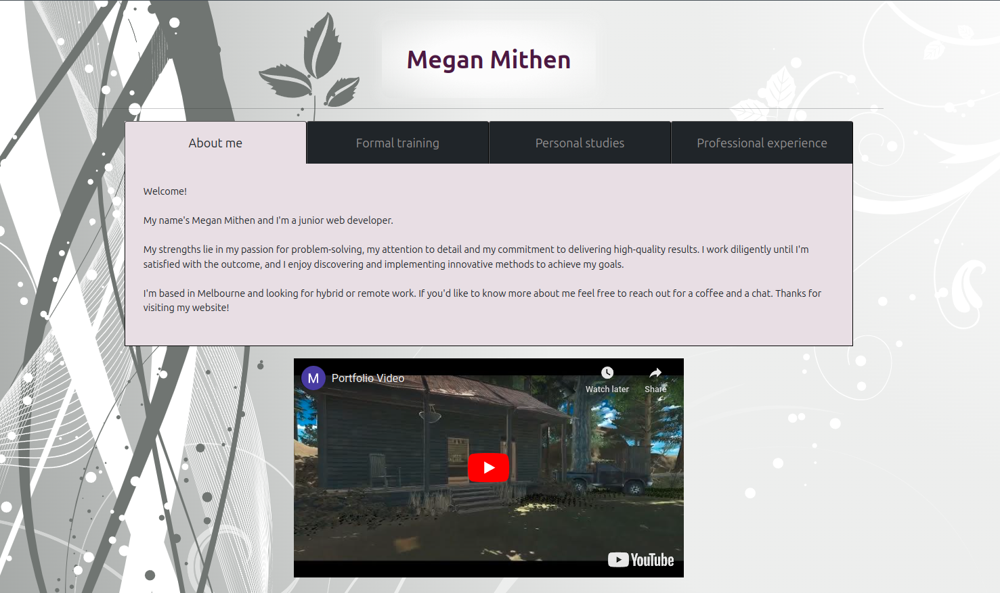
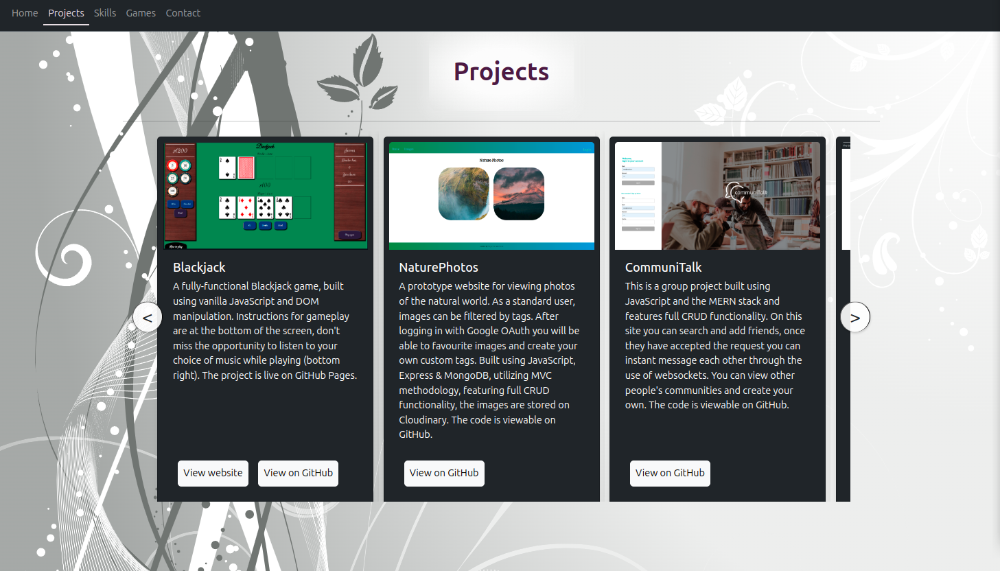
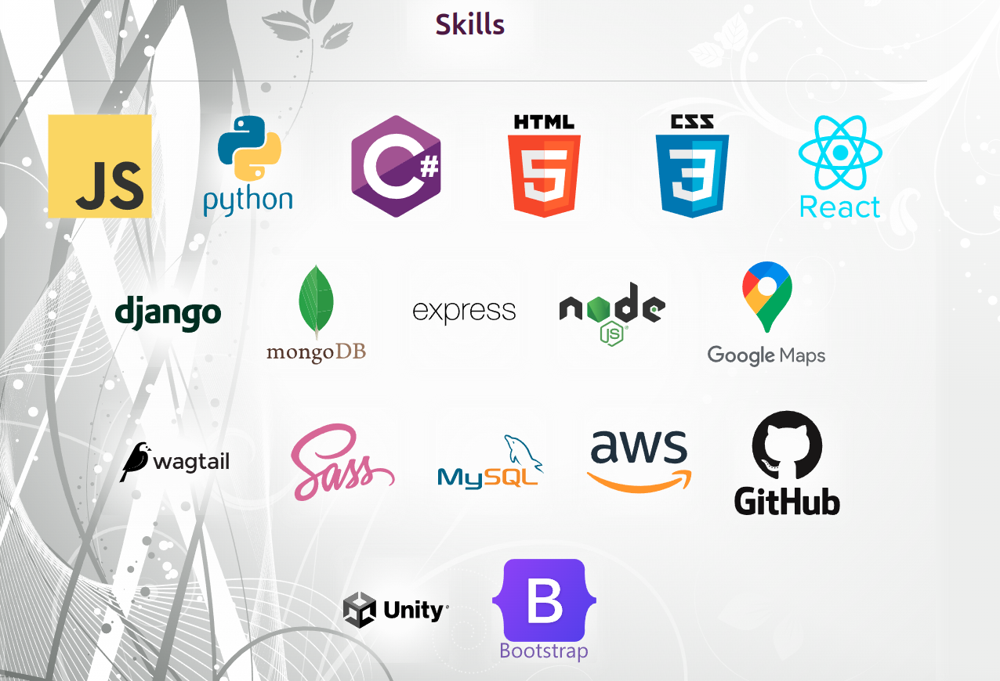
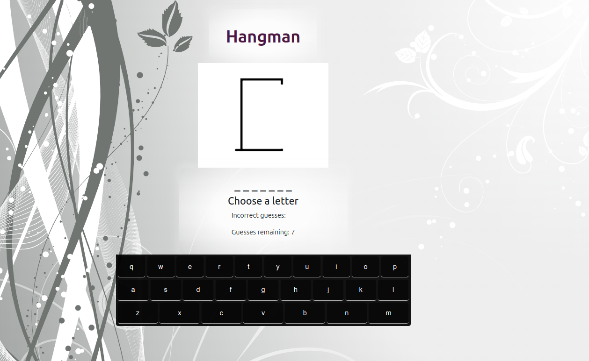
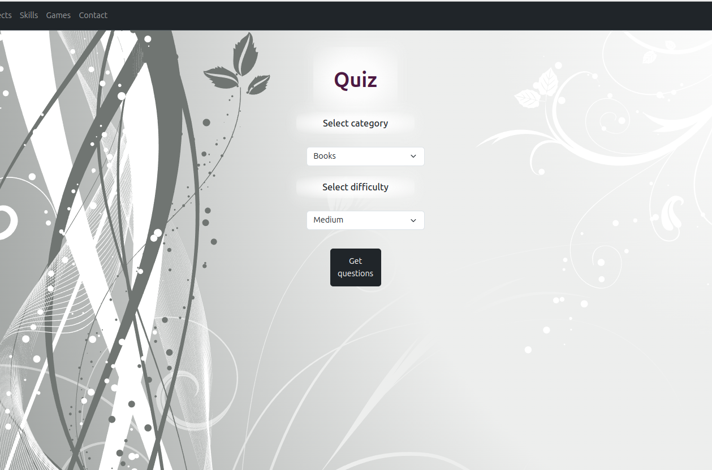
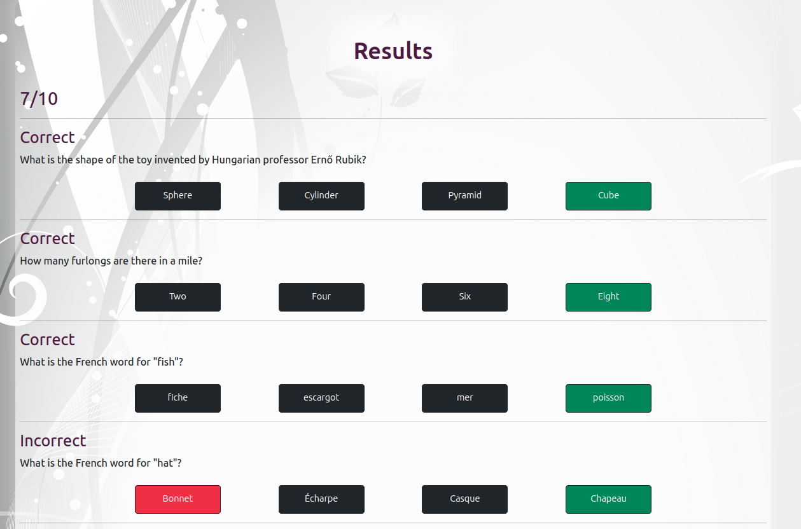

# Portfolio Website

## Overview

This website was built with JavaScript and React and employs some Bootstrap styling.  Credit for the virtual keyboard (in the Hangman game) lies with [these fine folks](https://virtual-keyboard.js.org/).  

The site is interactive, dynamic and responsive across all viewports.  The Games page utilises API calls for the jokes and the quiz. It's currently live on Netlify and can be visited [here](https://megkmportfolio.netlify.app/).

### Homepage

### Projects

### Skills

### Games

